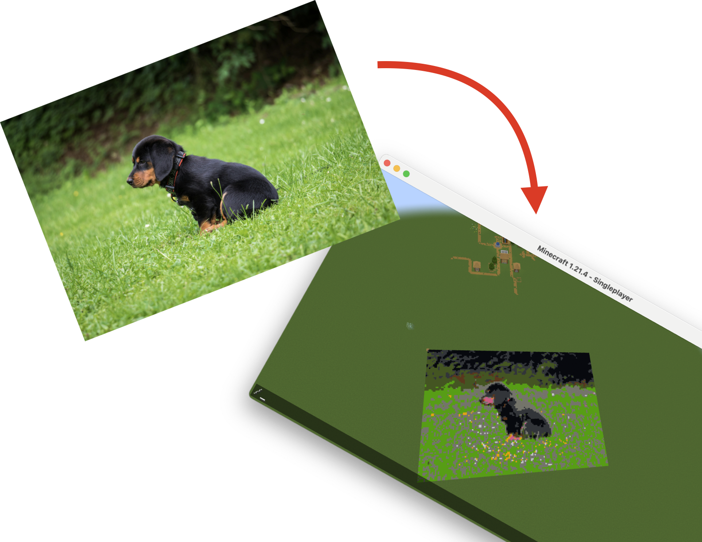
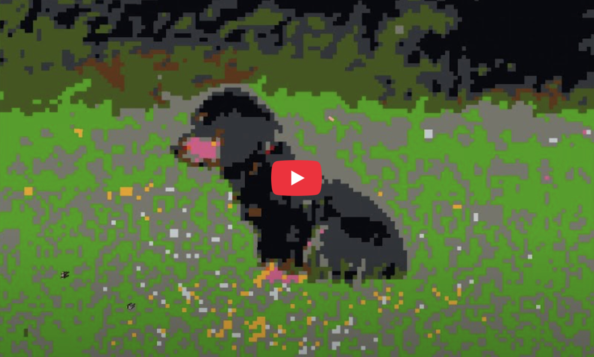
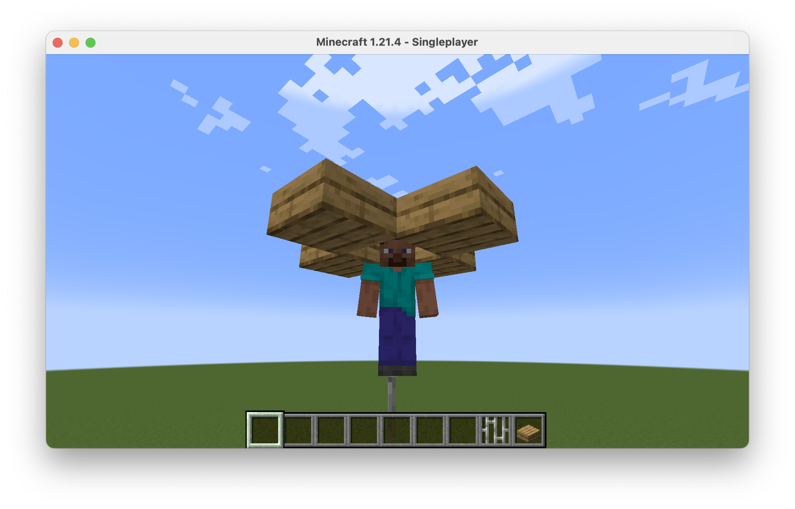

# MineArt

## Introduction
Paint images from your computer into your Minecraft: Java Edition world.



## Instructions
[NOTE] A demonstration video is available on YouTube:

[](https://www.youtube.com/watch?v=_knGTZxzX70 "Video Title")

* [First time users only] Clone this repository and navigate to the directory.
```sh
git clone https://github.com/ronitkunk/mineart.git
cd mineart
```
* [First time users only] Install the dependencies in `requirements.txt`
```sh
pip install -r requirements.txt
```
* Save a 3-channel image to the directory.
* Open a Minecraft: Java Edition world and open the console (press 'T'), leaving it empty. Be prepared to switch back to this window shortly.
* Run `driver.py` with arguments as indicated. Optional arguments are shown in brackets and must be preceded by their flags.
```sh
python driver.py IMAGE_PATH N [--starting_coordinates STARTING_X STARTING_Z] [--counter_max COUNTER_MAX] [--min_typing_speed MIN_TYPING_SPEED] [--delay DELAY] [--y Y_COORDINATE]
```
### Options
Required:
* IMAGE_PATH: A POSIX-compatible path to the 3-channel image that must be printed. Defaults to `data/dog.jpg`
* N: The number of blocks to use for the shorter edge of the image. Defaults to `10`.

Optional:
* STARTING_X and STARTING_Z: Starting x and z coordinates for printing. Defaults to `(0, 0)`.
* COUNTER_MAX: The number of seconds to count down before commands begin to be typed. Defaults to `10`.
* MIN_TYPING_SPEED: Minimum time between successive keystrokes in seconds. Defaults to `0.001`.
* DELAY: Time delay between input of successive commands in seconds. Defaults to `0.2`.
* Y: Y-coordinate for printing. Defaults to `-60`.

For example, the command:
```sh
python driver.py hello.jpg 40 --starting_coordinates 143 200 --counter_max 5 --min_typing_speed 0.005 --delay 0.3 --y -50
```
...would count down 5 seconds for you to switch to a Minecraft window with an open console, then start printing hello.jpg from (143, -50, 200), with the shorter side of the image being 40 blocks wide. Each character of a command will be printed at least 5 ms apart, and there will be at least 300 ms between commands.

## Pointers
* The printable region must be filled with air, and all chunks spanned by it must be loaded.
* Arrange for Minecraft to remain the active window throughout printing, otherwise, commands may be entered into other fields.
    * Entering gibberish into the user password field can lock you out of your system — be sure to prevent sleeping.
* Since the `setblock` command moves the player with every use, it is recommended that you build a stable viewing platform for the player. A sample design is shown in the image below:



## Credits
* Dog image from [Bond Vet](https://bondvet.com/b/what-to-do-when-your-dog-wont-poop)
* Minecraft: Java Edition from [Minecraft](https://minecraft.net)
* Python libraries from the [Python Package Index](https://pypi.org)
